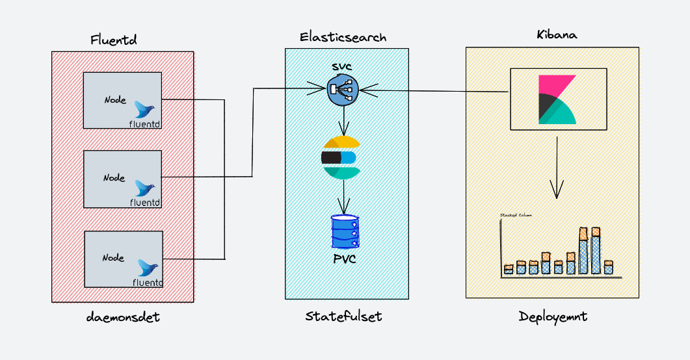
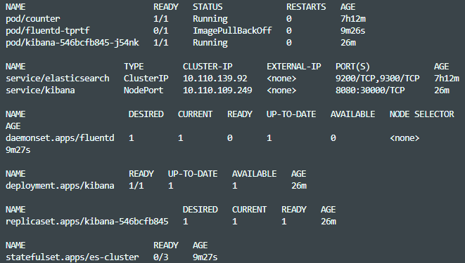

# DevOps Engineer Assignment - EFK Stack

This repository contains the terraform script to deploy the complete EFK (Elasticsearch, Fluentd, Kibana) monitoring stack locally on a minikube cluster.

I followed the recommended kubernetes architecture for EFK deployment.

Deployment is being done through a single terraform file.

Another approach could have been to define the Kubernetes manifest for each of the elements files and orchestrate their application through terraform.

# Dependencies

Tested locally using the following tools & versions.

| **Dependency** |
| -------------- |
 | [terraform@^1.2.3](https://releases.hashicorp.com/terraform/1.2.3/) |
 | [kubectl@^1.24](https://kubernetes.io/releases/#release-v1-24) |
 | [minikube@^1.26](https://github.com/kubernetes/minikube/releases/tag/v1.26.0) |
 | [docker](https://docs.docker.com/get-docker/) |

# Prequisities
`Docker` and `Minikube` have to be running locally before executing the terraform script.

# Running the Cluster
### Initialize Terraform

`terraform init`

### Preview Terraform Infrastructure

`terraform plan`

### Apply Terraform Infrastructure

`terraform apply --auto-approve`

### Destroy Terraform Infrastructure

`terraform destroy --auto-approve`

# Expected Cluster

